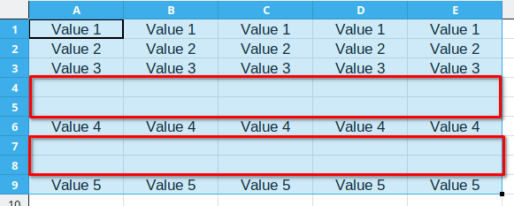
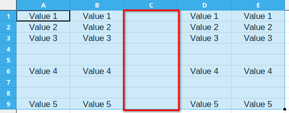
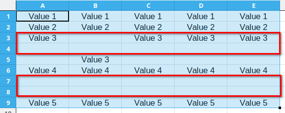
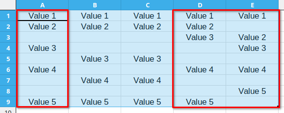

# Remove Blank Cells Help

## Contents

* [Overview](#overview)
* [Dialog options](#dialog-options)
    * [Remove all blank rows](#remove-all-blank-rows)
    * [Remove all blank columns](#remove-all-blank-columns)
    * [Remove rows based on a single column](#remove-rows-based-on-a-single-column)
    * [Remove columns based on a single row](#remove-columns-based-on-a-single-row)
* [Execution modes](#execution-modes)

## Overview

The **Remove Blank Cells** extension provides a variety of ways to remove blank rows and columns from the selected range in a LibreOffice Calc sheet.

To use this extension, first select the range you would like to remove blank cells from and do one of the following:

* Go to **Data - Remove blank cells** (or use the shortcut `Alt + Shift + B`) to open the main dialog and choose what you wish to do with the selected range.
* Go to **Data - Remove blank rows** (or use the shortcut `Alt + Shift + N`) to remove all blank rows in the selected range using the *Normal mode*.
* Go to **Data - Remove blank columns** (or use the shortcut `Alt + Shift + M`) to remove all blank columns in the selected range using the *Normal mode*.

Note that only data in the selected region is affected. Columns and rows outside the selection remain unchanged.

## Dialog options

When you select a range and open the extension dialog, you can select one of four available options. All of them can be executed either in *Normal mode* or in *Fast mode*. Read below for more information on these modes.

Depending on the currente selection, the dialog may enable or disable some of its functionalities. For example, if your selection has only one column, then the option *Remove blank columns* will be disabled.

### Remove all blank rows

This operation will remove all empty rows from the selection. In the example below, range `A1:E9` is selected and rows 4, 5, 7 and 8 will be removed.

### Remove all blank columns

This operation will remove all empty columns from the selection. In the example below, range `A1:E9` is selected and column C will be removed.

### Remove rows based on a single column

With this option you can define a single column that will be used as reference to decide if the entire row will be removed or not. In the example below, suppose you choose to remove all rows in the selection based on Column B. Therefore, whenever an empty value is found in column B, the entire row is deleted.

Beware that this option may remove actual data from your document. A warning message is displayed before proceeding.

### Remove columns based on a single row

With this option you can define a single row that will be used as reference to decide if the entire column will be removed or not. In the example below, suppose you choose to remove all columns in the selection based on Row 5. Therefore, whenever an empty value is found in Row 5, the entire column is deleted.

Beware that this option may remove actual data from your document. A warning message is displayed before proceeding.

## Execution modes

The removal of rows and columns can be done either using either the *Normal mode* or the *Fast mode*, which can be defined using the checkbox at the bottom of the dialog.

**Normal mode:** retain cell formatting, however it is slower than the *Fast mode*. Despite being slower, the difference in speed will only be noticed for large selections (more than a thousand rows).

**Fast mode:** this mode only considers text and numbers and does not retain formatting. This mode is recommended when the selection is very large and formatting is not an issue. Values such as dates, percentages and currencies are converted to their numeric value before being processed.
