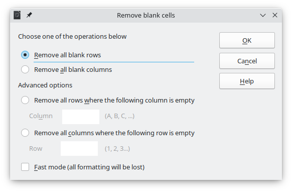

# Remove Blank Cells

This is an extension for [LibreOffice](https://www.libreoffice.org/) [Calc](https://www.libreoffice.org/discover/calc/) that removes blank rows and columns in various situations, such as single columns and single rows, as well as tables with multiple columns and rows.

## Table of Contents

 * [Installation](#installation)
 * [Usage](#usage)
 * [Compatibility](#compatibility)
 * [Reporting bugs](#reporting-bugs)
 * [Contributing](#contributing)

## Installation

To install this extension:

1) Download the [Latest OXT file](https://github.com/rafaelhlima/remove_blank_cells/releases/latest)
2) On any LibreOffice application, go to **Tools > Extensions Manager…**
3) Click **Add** and choose the OXT file
4) Click **OK** and Accept the licence to finish installation
5) Restart LibreOffice

## Usage

After installing the extension, the following menu entries will be added to the **Data** menu:

* **Remove blank cells:** opens the main extension dialog to define settings before carrying out any changes.
* **Remove blank rows:** removes blank rows in the current selection without showing the dialog. This option uses the Normal Mode.
* **Remove blank columns:** removes blank columns in the current selection without showing the dialog. This option uses the Normal Mode.

To quickly run the commands above, the following shortcuts are set by default:

| Command | Shortcut |
| --- | --- |
| Remove blank cells | `Alt + Shift + B` |
| Remove blank rows | `Alt + Shift + N` |
| Remove blank columns | `Alt + Shift + M` |

For more information on the options available in the dialog, read the [Help page](Documentation/ExtensionHelp.md).

## Compatibility

This extension is developed for LibreOffice Calc and its compatibility depends on the version being used:

* For LibreOffice 7.2 and newer, use the [latest version](https://github.com/rafaelhlima/remove_blank_cells/releases/latest) of the extension.
* For LibreOffice 7.1 and older, use version [0.9.1](https://github.com/rafaelhlima/remove_blank_cells/releases/tag/v0.9.1) of the extension, which does not have the latest features.

## Compatibility with OpenOffice

This extension is not developed for **Apache OpenOffice** and the latest releases use API that is only available for LibreOffice.

Some users have reported that v0.9.1 works in OpenOffice. However, I would like to stress that it is not the aim of this extension to support **Apache OpenOffice**.

## Reporting bugs

If you come across any bugs in the extension, please create an **Issue** ticked and provide a detailed report on how to reproduce the issue.

If the bug occurs in a specific data table, please attach a sample ODS file to your issue to make it easier to confirm the and fix the bug.

## Contributing

All forms of contribution are welcome! However, at the current stage of the project the priorities are:

* Translation of the [POT file](Translation/rb_strings.pot) to support more locales. Currently the extension supports “en-US”, “hu-HU”, “pl-PL”, “pt-BR” and “sv-SE”. Translated PO files are located in the folder [/Source/po/](Source/po/). Please submit PO files either as a merge request or as an issue with the attached PO file.
* Improvement to the icons design, so that they are more similar to the Colibre or Breeze icon sets.
* Testing and Bug fixing.
