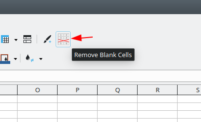
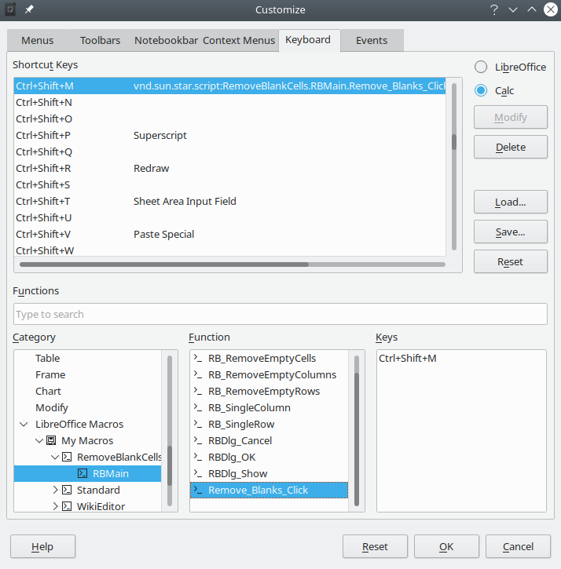
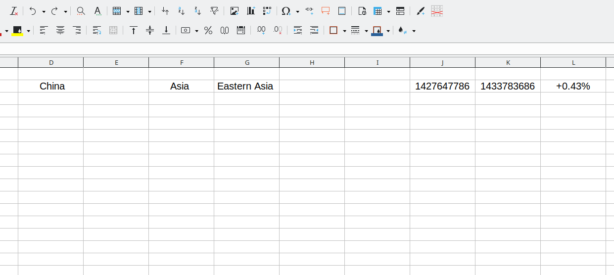
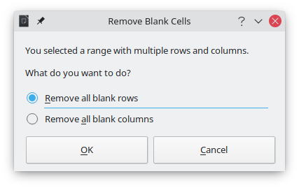
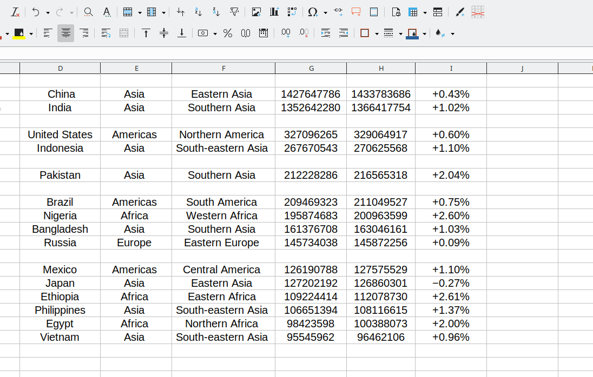
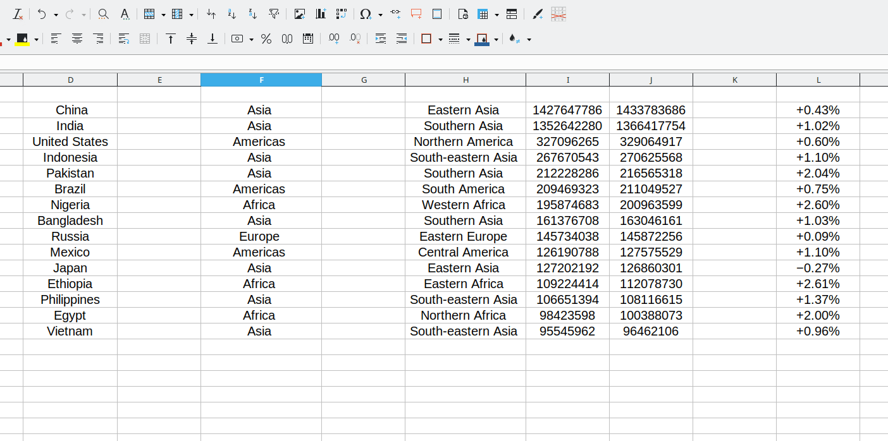
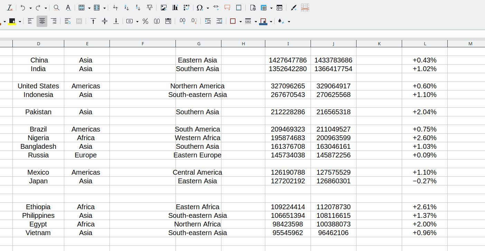

# Remove Blank Cells

This is an extension for LibreOffice Calc that removes blank cells in various situations, such as single columns and single rows, as well as tables with multiple columns and rows.

This extension is still in Beta stage, so bugs are expected. If anything goes wrong, please report an issue.

## Installation

To install this extension:

1) Download the [Latest OXT file](Releases/RBCells_0-9.oxt)
2) On any LibreOffice component, go to **Tools > Extensions Manager...**
3) Click **Add** and chose the OXT file
4) Click **OK** and Accept the licence to finish installation

After installing the extension, you'll notice a new icon in your standard toolbar named "Remove Blank Cells".

### Creating a Keyboard Shortcut

You can associate a keyboard shortcut to the *Remove_Blanks_Click* method, which is located in the module *RBMain* of the *RemoveBlankCells* library. This library is added to the *My Macros* container after the extension is installed.

To create a shortcut:

1) Open LibreOffice Calc and go to **Tools > Customize**
2) Select the **Keyboard** tab
3) In the **Shorcut Keys** section, choose which shortcut you wish to assign to this extension (for instance, *Ctrl+Shift+M*).
4) In the **Category** section, navigate to *LibreOffice Macros > MyMacros > RemoveBlankCells > RBMain*
5) In the **Function** section, choose *Remove_Blanks_Click* and click the **Modify** button

If you did everything right, your **Customize** dialog should look like this:

## Usage

This extension provides 5 different use cases for removing blank cells as described below. The extension decides what will be done based on the current selection in the active sheet.

### Remove Blanks in a Single Column

When you select a single column, the extension removes all blank cells placing cells with contents to the top of the selected range.

### Remove Blanks in a Single Row

When you select a single row, the extension removes all blank cells placing cells with contents to the left side of the selected range.

### Remove Blanks Rows in a Table

When you select a range with multiple rows and columns (a table), the extension will show a dialog box for you to decide what shall be done with the data.

If you select *Remove all blank rows*, then all rows with contents will be moved to the top of the selected range.

### Remove Blanks Columns in a Table

If you select *Remove all blank columns*, then all columns with contents will be moved to the left side of the selected range.

### Compact Data

This is still an experimental feature. If you select *Remove all blank cells (compact data)*, then all cells with contents will be compacted to the upper-left corner of the selected range.

## Compatibility

This extension was developed using LibreOffice 7.0. However, it should be compatible with LO 6.2 onwards.

All screenshots, GIFs and files were created using Kubuntu 20.10.
